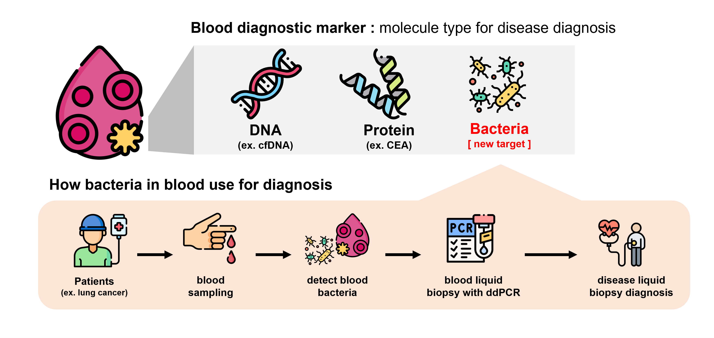
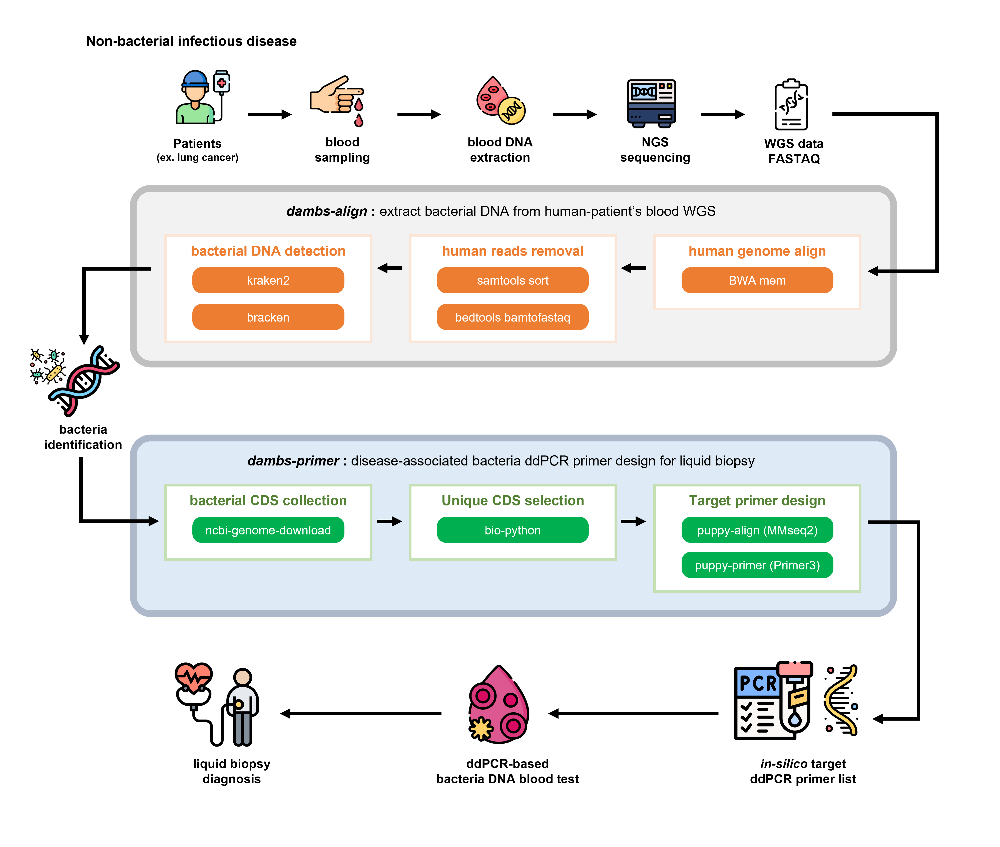

# Disease-Assoicated Microbiome base Blood Screening in python (DAMBSpy)

[](https://www.python.org/downloads/release/python-3100/)
[](https://abstar.readthedocs.io/en/latest/?badge=latest)


# ✨ Introduction
Recent studies have demonstrated that microbial DNA, which is typically absent from the blood, can be detected in patients with non-bacterial infectious diseases such as cancer. These findings indicate a potential association between the presence of specific microbes and certain diseases ([_Poore_ et al., Nature 2020](https://doi.org/10.1038/s41586-020-2095-1) ). The study revealed that low levels of foreign microbial DNA in the blood could serve as predictors of disease in patients. This ability to predict diseases based on the presence of specific microbes suggests that conditions might be diagnosed through simple liquid biopsies, circumventing the need for invasive tissue biopsies.

To detect these low levels of DNA in blood, several advanced technologies have been employed. Among these, droplet digital PCR (ddPCR) is particularly notable for its superior sensitivity compared to other methods. ddPCR's high sensitivity is attributed to its approach of partitioning the sample into thousands of droplets, which allows for the amplification and detection of individual DNA molecules within each droplet. This partitioning minimizes the impact of inhibitors and reduces background noise, resulting in highly accurate and quantitative detection of low-abundance DNA sequences. Consequently, ddPCR is exceptionally well-suited for identifying rare microbial DNA in blood samples, making it a valuable tool for early disease diagnosis.

This project aims to standardize the analysis pipeline using Python and various open-source tools. Additionally, it includes the design of ddPCR primers to verify the detection of blood microbes. Ultimately, the goal is to establish a foundational pipeline for disease diagnosis based on blood microbial markers.

<p align="center">
  
</p>


# 🚩 Key Features
- **Blood WGS Data Analysis**: This component involves the comprehensive analysis of whole genome sequencing (WGS) data obtained from patient blood samples. The process begins by mapping the sequencing data to the human genome to identify sequences that align with human DNA. Subsequently, the unmapped reads—those sequences that do not match the human genome—are analyzed. These unmapped reads are scrutinized to detect the presence of non-human microbial DNA, which could be indicative of microbial infections or associations with specific diseases. This step is crucial for identifying rare microbial DNA signatures that may be linked to disease states.

- **Automatic ddPCR Primer Design for Bacterial Targets**: This component focuses on enhancing the sensitivity of microbial DNA detection through the design of droplet digital PCR (ddPCR) primers. Once the microbial DNA has been identified from the WGS data, specific primers for ddPCR are designed automatically. These primers are tailored to target the microbial DNA sequences detected in the blood samples. The use of ddPCR allows for highly sensitive and precise quantification of these microbial DNA sequences, facilitating accurate and reliable detection even at low abundance levels. This step ensures that the detection method is both robust and scalable for diagnostic applications.

- **Standardization of Analysis Pipeline**: This tool aims to improve and standardize the entire analysis pipeline. The goal is to develop a streamlined, efficient, and reproducible workflow that can be consistently applied across different samples and settings. This involves refining existing methods to eliminate inefficiencies and complexities, thereby making the process more accessible and user-friendly. By standardizing the pipeline, the project ensures that the analysis can be reliably replicated and that results are consistent and comparable across different studies and applications. This standardization is essential for translating the pipeline into a practical diagnostic tool for clinical use, enabling the routine detection of microbial markers in blood for disease diagnosis.


# ✅ Installation
**DAMBSpy is only available for linux. Windows user can still execute DAMBSpy with a Windows Subsystem for Linux (WSL) such as Ubuntu.**

Installing DAMBSpy currently **REQUIRES 1) conda AND 2) pip.** Make sure both are installed prior to following the installation instructions below. 

## Exported environment (x86-64 & linux-64)
You can set up the conda environment to run DAMBSpy using the YAML definition found in this repository:

```bash
# Clone DAMBSpy GitHub directory
git clone https://github.com/brainpod-jihwan/DAMBSpy.git

# Change directory
cd DAMBSpy

# Create and set up conda environment
conda deactivate
conda env create -f environment.yml
conda activate dambs

# install additional software
conda install -c bioconda bwa bedtools samtools htslib
```

# ⚠️ Important: Before You Start !!
- Processing WGS data is **time-consuming** and requires **substantial RAM**. Additionally, the **huge storage size** needed for bacterial DNA analysis is significant.
    - [Hardware specifications for human data processing](https://github.com/kaist-ina/BWA-MEME?tab=readme-ov-file#notes)
    - [Hardware specifications for bacterial data processing](https://ccb.jhu.edu/software/kraken/MANUAL.html#system-requirements)
- Bacterial DNA is present in very low quantities and **may not be detectable in low-depth WGS data**.
- PCR can be unpredictable, and while primers may appear perfect in silico, **it is strongly recommended to confirm their specificity in vitro before use**.

# 🏷️ How it works
DAMBSpy consists of two main steps: `dambs-align` and `dambs-primers`. The `dambs-align` step focuses on removing human genomic sequences and identifying bacterial sequences, while `dambs-primers` designs ddPCR primers specific to the bacterial species detected in the previous step. Through this process, DAMBSpy aims to establish a system that utilizes previously unknown disease-associated bacteria present in human blood to diagnose diseases through liquid biopsy. This approach offers a non-invasive method to detect and diagnose conditions by identifying specific bacterial markers linked to various diseases.

### `dambs-align`
The process begins by taking blood WGS fastq files as input (pair-end fastq data). The input WGS fastq files are mapped to the human genome using `BWA`. Next, `SAMtools` is used to remove the sequences that mapped to the human genome, and `Bedtools` is employed to convert the unmapped sequences back into fastq format. These unmapped fastq sequences are then mapped to the bacterial genome using `Kraken2`. Based on the mapped reads, `Bracken` is used to identify which bacterial species are present in the blood.

### `dambs-primers`
Once the bacterial species have been identified, `dambs-primers` designs ddPCR primers targeting these bacteria. The first step is to download the corresponding CDS (protein coding sequence) fasta files from NCBI for the identified bacteria using their taxonomy IDs with `ncbi-genome-download`. These CDS sequences often include multiple substrains within the same taxonomy ID. To manage this, `Biopython` is utilized to remove redundant CDS sequences, leaving only one representative sequence per taxonomy ID. The remaining unique CDS sequences are then compared to the human CDS using `MMseq2`, which is integrated with `puppy-align`, to select bacterial genes that are not found in humans. Finally, suitable PCR primers for these unique bacterial genes are selected using `Primer3`, which is integrated with `puppy-primer`.

<p align="center">
  
</p>


# ✒️ Usage
**Always activate your conda environment before running DAMBSpy.**

```sh
conda activate dambs
```
**Check that you are using the most recent DAMBSpy version and update if needed**

```sh
conda list dambs # Check version
conda update dambs # Update dambs package
```

DAMBSpy operates in 2 main steps:

1) ``dambs-align`` - removes human genetic sequences from the input WGS data and identifies bacterial sequences, determining the specific bacterial species present in the blood.
2) ``dambs-primers`` -  designs ddPCR primers that are specific to the bacterial sequences identified in the previous step, ensuring high specificity and sensitivity for detecting these bacteria in subsequent analyses.

**IMPORTANT:** The syntax to run DAMBSpy varies depending on the installation mode.

If installed with **conda**, you do not need to specify the path to the scripts. For example:

```sh
dambs-align -h
```

DAMBSpy can be executed either from **command-line**.

## Command-line execution

Detailed usage information, including all the primer design parameters, can be seen by running ``-h`` or ``--help`` at each step.

```
dambs-align -h
dambs-primers -h
```

Remember to specify the **path** to the script if you installed DAMBSpy from the exported environment! 

## 0. Set-up Indexed Genome Database & INPUT FASTQ file (PREREQUISITE)

In this section, we will be setting up the indexed genome database necessary for gene alignment. Make sure you follow these steps carefully to ensure a successful setup.

### Human Genome

1. **Download Human Genome:**
   - Access the Ensembl genome database at [Ensembl FTP](https://asia.ensembl.org/info/data/ftp/index.html) to download the human genome fastq file. download both **DNA (FASTA)** and **CDS (FASTA)**.

2. **Store in HUMAN_REF_DIR:**
   - Save the downloaded human genome file in your specified `HUMAN_REF_DIR`.

3. **Index the Genome with BWA:**
   - Run the following command to index the human genome using BWA with **DNA (FASTA)** file.
     ```bash
     bwa index {HUMAN_REF_DIR}/human_genome.fa.gz
     ```

4. **Rename and Organize CDS Fasta File:**
   - Relocate the CDS FASTA file into a `CDS` folder and rename it to follow the `.fna` format.
     ```bash
     mkdir -p {HUMAN_REF_DIR}/CDS
     gunzip -c {HUMAN_REF_DIR}/human_genome.cds.all.fa.gz > {HUMAN_REF_DIR}/CDS/human_genome_cds_from_genomic.fna
     ```

### Bacterial Genome

1. **Download Bacterial Genome:**
   - Access the reference sequence indexes at [BenLangmead's Repository](https://benlangmead.github.io/aws-indexes/k2) to download the bacterial genome index files.

2. **Store in GERMS_REF_DIR:**
   - Save the downloaded bacterial genome index files in your specified `GERMS_REF_DIR`.


## 1. Identification of bacterial DNA sequnce from human blood WGS (dambs-align)

The `dambs-align` step is the first and essential step in identifying bacterial DNA sequences from human blood WGS data. This step must always be run first for any **new** sample analysis.


```
python dambs-align.py -s SAMPLE_PREFIX -hd HUMAN_GENOME_DIR/human_genome.fa.gz -gd GERMS_GENOME_DIR -o OUTPUT_DIR -f1 test_R1.fastq -f2 test_R2.fastq -rl 100 -mq 10 -mh 3 -t 8

python scripts/dambs-align.py -s SRR116165 -hd ../00_DATABASE/01_HUMAN/human_genome.fa.gz -gd ../00_DATABASE/02_GERMS -o output/test_run -f1 fastq/SRR116165_filtered_R1.fastq -f2 fastq/SRR116165_filtered_R2.fastq -rl 100 -mq 10 -mh 3 -t 8
```

This command will process the input FASTQ files to remove human sequences and identify bacterial sequences. The result will be stored in the output directory specified, and the key output file will be located at ```<OUTPUT_DIR>/{SAMPLE}.braken```. This file contains the bacterial species identified in the sample and will be used as input for the primer design step (Step 2).

The dambs-primers step can be run multiple times without needing to rerun dambs-align, as long as the bacterial community or the input data remains unchanged.


## 2. Design ddPCR primer sequenince for identified bacteria targeting (dambs-primers)

The second step involves designing ddPCR primers that are specific to the bacterial species identified in the previous step. These primers are designed to target unique genetic sequences within the identified bacteria, ensuring high specificity and sensitivity for ddPCR analysis.

The dambs-primers step **requires** the following arguments as input:

```
python dambs-primer.py -s SAMPLE_PREFIX -hd HUMAN_GENOME_DIR/human_genome.fa.gz -i  INPUT_BRAKEN -o OUTPUT_DIR

python scripts/dambs-primer.py -i output/test_run/SRR116165.braken -o output/test_run -hd ../00_DATABASE/01_HUMAN/CDS -s SRR116165
```
This command generates the primers needed for ddPCR targeting the bacterial species found in the sample. The output will include the designed primers that can be used for subsequent diagnostic assays.


# ⚙️ DAMBSpy parameters
Parameters for **``dambs-align``**
```
usage: dambs-align.py [-h] --sample SAMPLE --human_db HUMAN_DB --germs_db GERMS_DB --output_dir OUTPUT_DIR --fastq1 FASTQ1 --fastq2 FASTQ2 --read_len READ_LEN --min_qual MIN_QUAL --min_hit
                      MIN_HIT --thread_num THREAD_NUM

Run human and germs alignment pipeline.

options:
  -h, --help            show this help message and exit
  --sample SAMPLE, -s SAMPLE
                        Sample prefiex
  --human_db HUMAN_DB, -hd HUMAN_DB
                        Directory for human reference database
  --germs_db GERMS_DB, -gd GERMS_DB
                        Directory for germs reference database
  --output_dir OUTPUT_DIR, -o OUTPUT_DIR
                        Output directory
  --fastq1 FASTQ1, -f1 FASTQ1
                        Path to raw FASTQ file 1
  --fastq2 FASTQ2, -f2 FASTQ2
                        Path to raw FASTQ file 2
  --read_len READ_LEN, -rl READ_LEN
                        Read length
  --min_qual MIN_QUAL, -mq MIN_QUAL
                        Minimum quality for Kraken
  --min_hit MIN_HIT, -mh MIN_HIT
                        Minimum hit groups for Kraken
  --thread_num THREAD_NUM, -t THREAD_NUM
                        Number of threads

```


Parameters for **``dambs-primers``**
```
usage: dambs-primer.py [-h] --input_braken INPUT_BRAKEN --output_dir OUTPUT_DIR --human_db HUMAN_DB --sample SAMPLE

Generate and execute genome download and processing commands.

options:
  -h, --help            show this help message and exit
  --input_braken INPUT_BRAKEN, -i INPUT_BRAKEN
                        Input file containing taxonomy IDs.
  --output_dir OUTPUT_DIR, -o OUTPUT_DIR
                        Output directory for the downloads.
  --human_db HUMAN_DB, -hd HUMAN_DB
                        Path to the human database CDS.
  --sample SAMPLE, -s SAMPLE
                        Sample prefix.

```


# 📓 Reference
- Poore, G. D., et al. (2020). Microbiome analyses of blood and tissues suggest cancer diagnostic approach. Nature.
- Zmrzljak, U. P., et al. (2021). Detection of Somatic Mutations with ddPCR from Liquid Biopsy of Colorectal Cancer Patients. Genes.
- Ghezzi, H., et al. (2023). PUPpy: a primer design pipeline for substrain-level microbial detection and absolute quantification. doi:http://dx.doi.org/10.14288/1.0438913


